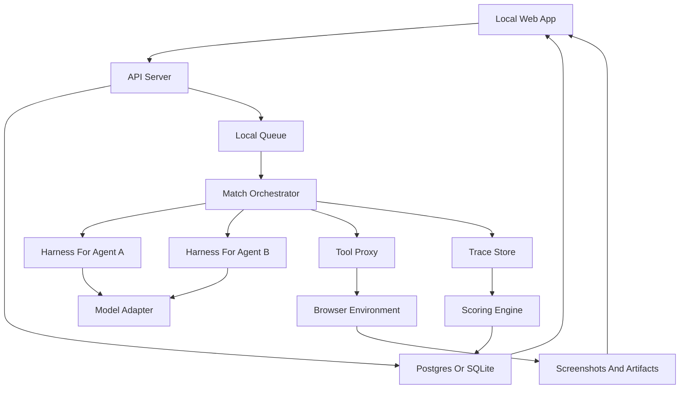

# lvl

lvl is a local-first AI agent evaluation arena. The first version should be a simple browser-based app where we can create matches, choose models, run those matches one after another or in parallel, monitor active runs, inspect outputs, and score how well each model plus harness performs.

The product is not just a leaderboard. The core value is the full loop:

```text
Create match -> Run agents through harness -> Interact with environment -> Record trace -> Score run -> Replay and compare
```

## Product Goal

Build a local web app that can answer:

- Which model plus harness completes a task better?
- Which one is cheaper, faster, and more reliable?
- Which one handles browser interactions and interruptions better?
- Can we replay the match step by step and explain the score?

The first target is intentionally small:

- Run locally.
- Create a match from a web UI.
- Choose models or dummy agents.
- Run a simple task.
- Watch active matches continue in the background.
- Open a match replay page.
- See model outputs, tool actions, browser state, and score events.

## Current Local MVP

The repository currently includes a runnable local MVP:

- Vite + React web UI.
- Express API server.
- JSON-file storage under `data/`.
- Dummy model adapters.
- OpenRouter model adapter path.
- Owned Playwright/Chromium browser runner.
- Browser tool contract with `mode: "state"` and `mode: "run"`.
- Stronger browser parser for fenced JSON, nested tool wrappers, direct scripts, chess square clicks, coordinate clicks, inputs, selects, and key presses.
- Barebones harness.
- Real local browser game pages rendered in Chromium.
- Interactive chess opening task with click-source/click-destination moves.
- Deterministic popup hurdle.
- Background match orchestrator with sequential and parallel modes.
- Trace recording.
- Chromium screenshots in replay.
- Scorecard generation.
- Elo ratings for model head-to-head results.
- Match replay UI.
- Live replay frame that updates while the selected match is running.
- Previous match list for reopening older run traces.
- Multi-seed suite creation from the match form.
- Multi-seed suite smoke script.
- Rich analytics: score distribution, task success, model Elo, failure labels, cost, latency.
- Smoke test script.
- Benchmark batch script for local/OpenRouter matchups.

Run it locally:

```bash
npm install
npm run dev
```

Then open:

```text
http://localhost:5173
```

Useful checks:

```bash
npm run typecheck
npm run build
npm run parser:test
npm run smoke
npm run chess:verify
npm run suite:smoke
npm run benchmark
```

`suite:smoke` runs the same dummy matchup across five seeds to verify multi-seed suite execution.

Default benchmark batch:

- Dummy Strong vs Dummy Chaotic on `target-grid-duel`.
- GPT-4o Mini vs Dummy Strong on `target-grid-duel`.
- Qwen 3.5 9B vs Dummy Strong on `target-grid-duel`.
- GPT-4o Mini vs Qwen 3.5 9B on `simple-checkout-popup`.

Additional configured OpenRouter models can be selected from the UI, but provider rate limits may affect long batches.

Current browser tasks:

- `target-grid-duel`: click highlighted tiles and avoid traps.
- `chess-opening-e4`: play `1. e4` by clicking `e2` then `e4` on a full chess board.
- `simple-checkout-popup`: add item to cart, handle popup, confirm checkout.
- `confirm-button-decoy`: click the real confirmation target.

Local data and traces are intentionally ignored by git:

```text
data/
artifacts/
.env.local
```

## Build Philosophy

Start with one complete vertical slice instead of many incomplete systems.

The first working version should include:

1. A local web app.
2. A match creation flow.
3. A shared barebones harness.
4. A simple environment.
5. A trace log.
6. A basic scoring system.
7. A match detail page.

Once that loop works, we can add better harnesses, browser games, chaos events, real model providers, graphs, and leaderboards.

## High-Level Architecture



Important rule:

Models should not directly control the browser, filesystem, shell, or game state. They should request actions through the harness. The tool proxy validates, executes, records, and meters those actions.

## Core Pieces

### 1. Local Web App

The local web app is the control center.

It should support:

- Creating a new match.
- Choosing models or dummy agents.
- Choosing a task or environment.
- Choosing whether to run immediately or queue.
- Monitoring active matches.
- Starting another match while previous matches keep running.
- Opening completed matches.
- Viewing traces, outputs, screenshots, scorecards, and graphs.

Initial pages:

- `/` - dashboard with active and recent matches.
- `/matches/new` - create match page.
- `/matches/:id` - match detail and replay.
- `/tasks` - list of available tasks.
- `/models` - configured models and dummy agents.
- `/analytics` - score and cost graphs, added after the basic loop works.

Recommended first stack:

- Next.js for web UI.
- Tailwind for styling.
- shadcn/ui for basic components.
- API routes or a separate API service, depending on how quickly we want worker separation.

For the first version, a single app can host the UI and API. If background workers become awkward, split the worker into a separate package.

### 2. Match Creation

A match is the user-facing object.

For now, one match can contain two runs:

- Agent A run.
- Agent B run.

Both runs should receive:

- Same task.
- Same seed.
- Same budget.
- Same environment version.
- Same hurdle or chaos schedule, if enabled.

Example match form fields:

- Match name.
- Task.
- Environment type.
- Agent A model.
- Agent A harness.
- Agent B model.
- Agent B harness.
- Max steps.
- Max tool calls.
- Timeout.
- Seed.
- Run mode: sequential or parallel.
- Hurdles enabled: yes/no.

Match states:

- `queued`
- `running`
- `completed`
- `failed`
- `cancelled`

Run states:

- `queued`
- `running`
- `waiting_for_model`
- `executing_tool`
- `scoring`
- `completed`
- `failed`
- `cancelled`

### 3. Shared Barebones Harness

The harness is the layer that lets models actually participate in a task.

The harness should:

- Receive observations from the environment.
- Build the model prompt.
- Call the selected model adapter.
- Parse model output into an action.
- Send the action to the tool proxy.
- Track retries, invalid actions, and budget usage.
- Emit trace events for every step.

At first, keep the harness simple and shared.

Later, harnesses can become a separate competitive dimension:

- Same model with different harnesses.
- Same harness with different models.
- Browser-specific harness.
- Coding-agent-style harness.
- Planning-heavy harness.
- Fast minimal harness.

#### Pi Coding Agent As Starter Harness

Using a Pi coding agent style harness as a starting point is reasonable if we treat it as an interchangeable implementation, not as the permanent product architecture.

The harness interface should stay generic:

```ts
export interface AgentHarness {
  id: string;
  version: string;
  runStep(input: HarnessStepInput): Promise<HarnessStepOutput>;
}
```

The Pi-style harness can be one implementation:

```text
packages/harness-pi/
```

But the orchestrator should only depend on the shared interface:

```text
packages/harness/
```

That way we can replace it later without rewriting match execution, scoring, replay, or the UI.

### 4. Model Adapters

The model adapter normalizes providers.

The rest of the system should not care whether the model is OpenAI, Anthropic, Gemini, local Ollama, or a dummy model.

Minimal interface:

```ts
export interface ModelAdapter {
  id: string;
  provider: string;
  call(input: ModelInput): Promise<ModelOutput>;
}
```

Start with:

- `dummy-fast` - returns predictable valid actions.
- `dummy-bad` - sometimes loops or chooses invalid actions.
- `manual` - optional debug mode where a human can enter actions.

Then add real providers:

- OpenAI.
- Anthropic.
- Gemini.
- Local/Ollama.

This lets us test the whole arena before spending money on model calls.

### 5. Browser Interaction Layer

Browser-based environments are the best direction because they let us create many tasks, games, and head-to-head challenges visually.

The app owns its browser runtime. Do not depend on the Ghost browser extension for this product.

Current implementation:

- Launches an isolated Chromium instance through Playwright.
- Renders the task page directly into that browser context.
- Gives the harness a single browser tool instead of many separate tools.
- Records indexed elements, model output, browser actions, score events, and screenshots.
- Closes the browser context after each run so matches do not pollute each other.

The browser interface follows a browser-use shape instead of exposing a flat list of separate tools such as `browser.click` or `browser.type`.

The agent should receive one browser tool:

```ts
type BrowserToolInput =
  | {
      mode: "state";
      tab_id?: number | string;
      include_text?: boolean;
      include_screenshot?: boolean;
      max_length?: number;
      max_elements?: number;
      group_title?: string;
    }
  | {
      mode: "run";
      tab_id?: number | string;
      max_actions?: number;
      script: string;
    };
```

`mode: "state"` returns the current browser state:

- Connected status.
- Tabs.
- Current URL and title.
- Interactive element tree.
- Visible page text.
- Optional screenshot.
- Current preferred tab for the run.

`mode: "run"` executes a restricted async browser script. Inside that script, the agent gets a browser runtime API:

```ts
const tabs = await browser.tabs();
const tab = await browser.newTab("https://example.com");
await tab.snapshot();
await tab.click(3);
await tab.input(4, "hello");
await tab.keys("Enter");
const state = await tab.snapshot();
return state;
```

Runtime APIs to support first:

- `browser.tabs()`
- `browser.newTab(url, options?)`
- `browser.currentTab()`
- `browser.switchTab(tabId)`
- `browser.wait(seconds?)`
- `browser.notify(title, message)`
- `browser.closeGroup(groupTitle)`
- `browser.closeAllTabs(options?)`
- `tab.snapshot(options?)`
- `tab.resnapshot(options?)`
- `tab.goto(url, options?)`
- `tab.click(refOrTarget, options?)`
- `tab.clickAndSnapshot(refOrTarget, options?)`
- `tab.clickAt(x, y)`
- `tab.input(ref, text, options?)`
- `tab.safeInput(ref, text, options?)`
- `tab.insertText(text, options?)`
- `tab.uploadFile(ref, filePathOrPaths)`
- `tab.uploadAndVerify(ref, filePathOrPaths)`
- `tab.keys(keys, options?)`
- `tab.scroll(options?)`
- `tab.select(ref, text)`
- `tab.dropdownOptions(ref)`
- `tab.back()`
- `tab.findText(text, options?)`
- `tab.searchPage(pattern, options?)`
- `tab.screenshot(options?)`
- `tab.extract(code, options?)`
- `tab.close()`

Lower-level CDP-style escape hatches should exist for harder pages:

- `browser.cdp.runtimeEvaluate(tabId, code, options?)`
- `browser.cdp.domQuery(tabId, selector, options?)`
- `browser.cdp.describeNode(tabId, selectorOrRef, options?)`
- `browser.cdp.boxModel(tabId, selectorOrRef, options?)`
- `browser.cdp.accessibility(tabId, options?)`
- `browser.cdp.waitForNetworkIdle(tabId, options?)`
- `browser.cdp.handleDialog(tabId, options?)`
- `browser.cdp.clipboardPaste(tabId, text, options?)`
- `browser.cdp.hoverFocus(tabId, target, options?)`
- `browser.cdp.dragDrop(tabId, from, to, options?)`
- `browser.cdp.fileInputDiagnostics(tabId, target, options?)`

Self-healing helpers can be supported later:

```text
~/ghost/browser/
  registry.md
  helpers/
  recipes/
```

The runtime can expose helpers as:

```ts
await browser.helpers.someNamespace.someHelper(args);
```

This lets agents recover from brittle pages without bloating the core tool interface.

Implementation direction:

- Use the browser protocol as the product API.
- Use Playwright/Chromium as the first executor.
- Keep the harness behind the `browser` tool contract, not Playwright internals.
- Add optional lower-level browser helpers later only if real tasks require them.

Current Chromium flow:

```text
agent harness
  -> browser tool mode=state/mode=run
  -> Playwright-backed browser runtime
  -> isolated Chromium context
  -> local task page
  -> indexed DOM actions and screenshots
```

For development, task pages are also viewable in the browser:

```text
/task-pages/:taskId?seed=818
```

The first real browser game task is:

```text
target-grid-duel
```

The objective is to click the highlighted target tile three times while avoiding trap tiles and clearing any injected popup.

Runtime actions supported behind the browser tool:

- `get_content`
- `click`
- `input`
- `send_keys`
- `screenshot`

Planned runtime actions:

- `navigate`
- `scroll`
- `select_dropdown`
- `upload_file`
- `find_text`
- `search_page`
- `accessibility_snapshot`
- `network_idle`

The model should not receive the entire raw DOM by default. The environment can provide a simplified observation:

- Current URL.
- Page title.
- Visible text.
- Important elements.
- Screenshot reference.
- Last action result.
- Task instructions.

### 6. Environments

An environment is where the match happens.

Every environment should expose the same contract:

```ts
export interface EvalEnvironment {
  reset(seed: number): Promise<Observation>;
  step(action: Action): Promise<StepResult>;
  score(trace: Trace): Promise<Scorecard>;
}
```

Start with one simple task environment.

Good first options:

- Button-click task: find and click the correct button.
- Mini form task: fill a form and submit.
- Simple browser game: reach a target score.
- Tiny checkout flow: add item, close popup, submit.

The first environment should be boring but complete. The goal is to prove the system, not the game design.

### 7. Hurdles And Chaos Events

Hurdles are controlled interruptions or complications inside a match.

Examples:

- Popup appears.
- Button moves.
- Form field label changes.
- Tool call fails once.
- Page load is delayed.
- Distractor text appears.
- Wrong-looking but invalid button appears.
- Confirmation page requires verification.

Hurdles should be deterministic.

Each match gets a seed. The seed controls when hurdles appear and what variation is used. If two agents are in the same match, both should face the same hurdle schedule.

Hurdle event format:

```ts
export interface HurdleEvent {
  id: string;
  type: string;
  stepIndex: number;
  seed: number;
  payload: Record<string, unknown>;
}
```

The trace should record:

- When the hurdle appeared.
- What changed.
- Whether the agent noticed or recovered.
- Score impact.

### 8. Scoring System

Use scorecards first, total scores second.

Initial score dimensions:

- Task success.
- Efficiency.
- Robustness.
- Tool-use quality.
- Progress.
- Verification.
- Cost.
- Latency.

Suggested MVP weights:

```text
35% task success
20% efficiency
15% robustness
10% progress/planning proxy
10% tool-use quality
10% consistency
```

For local early testing, consistency may be hard to calculate from one run. It can start as `null` or be computed after multiple seeds.

Example scorecard:

```json
{
  "total": 82.4,
  "task_success": 100,
  "efficiency": 78,
  "robustness": 70,
  "progress": 85,
  "tool_use_quality": 90,
  "consistency": null,
  "cost_usd": 0.03,
  "latency_ms": 18420,
  "failure_labels": []
}
```

Failure labels:

- `looping`
- `invalid_action`
- `hallucinated_state`
- `missed_popup`
- `wrong_target`
- `no_verification`
- `budget_exceeded`
- `tool_error`
- `gave_up`

### 9. Match Replay

Replay is the trust layer.

For every step, store:

- Observation shown to the agent.
- Raw model output.
- Parsed action.
- Tool call.
- Tool result.
- Screenshot before or after.
- Score delta.
- Hurdle event, if any.
- Error, if any.

Replay UI should show:

- Timeline on the left.
- Screenshot/browser state in the center.
- Model output and parsed action on the right.
- Score events below.

The user should be able to understand exactly why one agent won.

### 10. Running Matches Sequentially Or In Parallel

Do not hardcode this into the match logic.

Use a queue with configurable concurrency.

Local modes:

- Sequential: concurrency `1`, easiest for debugging.
- Parallel: concurrency `N`, useful for running multiple matches or both agents at once.

Configuration:

```env
MATCH_WORKER_CONCURRENCY=1
MATCH_DEFAULT_TIMEOUT_MS=120000
MATCH_DEFAULT_MAX_STEPS=30
MATCH_DEFAULT_MAX_TOOL_CALLS=60
```

The UI should allow:

- Start match and monitor it.
- Start match and return to dashboard.
- Create another match while previous matches keep running.
- Cancel a running match.
- Retry a failed match.

### 11. Graphs And Analytics

Graphs should come after traces and scorecards are reliable.

First useful charts:

- Score by model.
- Score by harness.
- Success rate by task.
- Cost per completed task.
- Tool calls per completed task.
- Robustness score with hurdles enabled vs disabled.
- Latency by model.
- Failure label frequency.
- Head-to-head win rate.

Later:

- Elo or Glicko ratings.
- Confidence intervals.
- Regression trends over time.
- Task difficulty calibration.

### 12. Storage

For the first local version, keep storage simple.

Option A:

- SQLite for metadata.
- Local filesystem for traces and screenshots.

Option B:

- Postgres for metadata.
- Local filesystem or MinIO for artifacts.

Recommended path:

- Start with SQLite if we want maximum speed.
- Use Postgres if we want the schema to be closer to production from day one.

Tables/entities:

- `models`
- `harnesses`
- `tasks`
- `matches`
- `runs`
- `steps`
- `tool_calls`
- `score_events`
- `scorecards`
- `artifacts`

### 13. Reproducibility And Versioning

This is one of the most important parts of the whole product.

Every run should be reproducible or at least explain why it cannot be reproduced exactly.

Store these fields for each run:

- `seed`
- `task_id`
- `task_version`
- `environment_version`
- `harness_id`
- `harness_version`
- `model_id`
- `model_version`
- `system_prompt_hash`
- `tool_schema_hash`
- `budget_json`
- `hurdle_schedule_hash`
- `created_at`

If any of these change, the score should be treated as a different benchmark result.

This prevents a common benchmark problem: two results looking comparable when they were actually produced with different prompts, tools, seeds, or task versions.

### 14. Security And Sandboxing

Even local-first evals need guardrails because agents will eventually control browsers, files, shell commands, or APIs.

Initial safety rules:

- No real secrets inside task environments.
- No unrestricted filesystem access.
- No direct shell access from models.
- Browser tasks should use local test pages or allowlisted domains.
- Tool calls should pass through the tool proxy.
- File tasks should run in temporary workspaces.
- Artifacts should never store API keys or raw secret values.

The browser environment should be disposable. A failed or malicious run should not pollute the next run.

Later, coding/file environments should run in containers.

### 15. Live Updates And Cancellation

The UI should not only show completed matches. It should feel alive while matches are running.

Useful live events:

- Match queued.
- Run started.
- Step started.
- Model output received.
- Tool call started.
- Tool call finished.
- Screenshot captured.
- Score event emitted.
- Run completed.
- Run failed.

Implementation options:

- Server-sent events for simple local live updates.
- WebSockets if bidirectional control becomes useful.
- Polling as a temporary fallback.

Cancellation should be designed early:

- Cancel match.
- Cancel one run.
- Stop after current step.
- Mark cancelled in storage.
- Preserve partial trace for debugging.

### 16. Task Authoring

Tasks should be easy to create. If tasks are annoying to write, the benchmark will not grow.

Each task should define:

- Task title.
- Task instructions shown to the model.
- Environment type.
- Starting URL or initial state.
- Success condition.
- Failure condition.
- Max steps.
- Allowed tools.
- Optional hurdle configuration.
- Scoring rubric.

Example task file shape:

```json
{
  "id": "browser-click-correct-button",
  "version": "0.1.0",
  "environment": "browser",
  "instructions": "Click the button labeled Confirm.",
  "max_steps": 8,
  "allowed_tools": ["browser"],
  "browser_permissions": {
    "allow_state": true,
    "allow_run": true,
    "max_actions_per_call": 10
  },
  "success": {
    "type": "url_or_state",
    "target": "confirmed"
  }
}
```

Start with hand-written tasks. Add generators later for dynamic benchmark suites.

### 17. Testing And Quality Checks

This project can become confusing fast, so test the protocol boundaries early.

Minimum tests:

- Harness parses valid model output into actions.
- Harness rejects invalid model output cleanly.
- Tool proxy records every action.
- Environment resets deterministically with the same seed.
- Scoring produces the same result for the same trace.
- Queue can run two matches without mixing traces.
- Replay page can render a partial failed run.

Golden traces are especially useful. Save a few known traces and assert that scoring remains stable as the code changes.

### 18. Artifact Cleanup

Traces, screenshots, videos, and logs can get large quickly.

Local cleanup policy:

- Keep metadata forever unless deleted by the user.
- Keep screenshots and artifacts under `ARTIFACT_DIR`.
- Track artifact sizes.
- Allow deleting artifacts for old runs.
- Keep scorecards even if screenshots are deleted.

Later production cleanup:

- Retention policies.
- Compressed trace bundles.
- Object storage lifecycle rules.
- Export before delete.

### 19. Suggested Repo Structure

```text
lvl/
  apps/
    web/
      app/
      components/
      lib/
  packages/
    protocol/
    harness/
    harness-pi/
    model-adapters/
    scoring/
    storage/
  workers/
    orchestrator/
    env-browser/
    env-simple/
  tasks/
    simple/
    browser/
  docs/
    trace-schema.md
    scoring.md
    harness.md
```

### 20. Configuration

Environment variables:

```env
DATABASE_URL=file:./local.db
ARTIFACT_DIR=./artifacts

MATCH_WORKER_CONCURRENCY=1
MATCH_DEFAULT_TIMEOUT_MS=120000
MATCH_DEFAULT_MAX_STEPS=30
MATCH_DEFAULT_MAX_TOOL_CALLS=60
MATCH_LIVE_EVENTS=polling

OPENAI_API_KEY=
ANTHROPIC_API_KEY=
GEMINI_API_KEY=

BROWSER_HEADLESS=false
BROWSER_VIEWPORT_WIDTH=1280
BROWSER_VIEWPORT_HEIGHT=800
BROWSER_ALLOWED_ORIGINS=http://localhost:3000,http://localhost:4000
BROWSER_CONTROL_URL=http://127.0.0.1:34981
BROWSER_CONTROL_TOKEN=
BROWSER_EXTENSION_WS_PORT=34981
BROWSER_MAX_ACTIONS_PER_CALL=10

TRACE_SCREENSHOTS=true
TRACE_SAVE_MODEL_RAW_OUTPUT=true
TRACE_MAX_ARTIFACT_MB=500
```

For dummy local runs, no model API key should be required.

### 21. First Milestone

The first milestone should be:

> A local web app where we can create a match between two dummy agents on one simple browser task, let it run in the background, open the match page, replay both runs, and see a scorecard.

Definition of done:

- Dashboard shows active and completed matches.
- New match form exists.
- Dummy agents can be selected.
- One simple environment runs.
- The orchestrator records step traces.
- The scoring engine produces a scorecard.
- Match detail page shows step-by-step replay.
- A second match can be started while the first keeps running.
- Partial traces survive failed or cancelled runs.
- The same task and seed can be rerun.

### 22. Build Order

This is the practical order to build the system:

1. Scaffold local web app.
2. Add match creation UI.
3. Add local API routes for matches, tasks, models, and runs.
4. Add storage schema.
5. Add reproducibility fields and run version metadata.
6. Add dummy model adapters.
7. Add shared harness interface.
8. Add barebones harness implementation.
9. Add local queue and orchestrator.
10. Add cancellation and partial trace persistence.
11. Add one simple environment.
12. Add trace logging.
13. Add scoring engine.
14. Add match detail and replay UI.
15. Add live match updates.
16. Add Playwright/Chromium browser environment.
17. Add a real browser game page.
18. Add seeded hurdles.
19. Add task authoring format.
20. Add score distribution, task charts, failure labels, and Elo.
21. Add real model providers.
22. Add better harnesses.

### 23. What To Avoid Early

Avoid building these first:

- Public leaderboard.
- Too many environments.
- Complex tournament logic.
- Browser extension.
- LLM-as-judge scoring.
- Kubernetes or distributed infra.
- Full plugin marketplace.

These can come later. The first local version should focus on the core loop.

## Current Product Shape

The product should feel like this:

1. Open local web app.
2. Click "New Match".
3. Choose Agent A and Agent B.
4. Choose a task.
5. Choose sequential or parallel run mode.
6. Start match.
7. Leave it running or monitor live.
8. Open replay.
9. See who won and why.
10. Compare results in charts.

That is the foundation. Everything else builds on top of it.
# lvl
